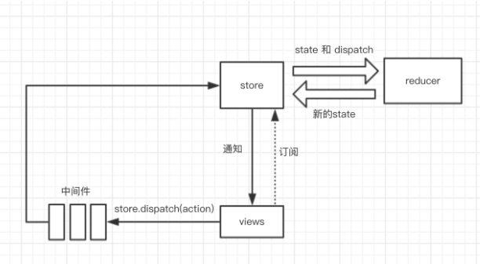

# 一、react 生命周期

React 的生命周期从广义上分为三个阶段：挂载、渲染、卸载  
因此可以把 React 的生命周期分为两类：挂载卸载过程和更新过程。  
React 的生命周期图:


## 1.挂载卸载过程

1.1.constructor()
constructor 构造函数，最先被执行;我们通常在构造函数里初始化 state 对象或者给自定义方法绑定 this;它接受两个参数：props 和 context，当想在函数内部使用这两个参数时，需使用 super()传入这两个参数。
注意：只要使用了 constructor()就必须写 super(),否则会导致 this 指向错误。

context 使用:
https://blog.csdn.net/weixin_30471561/article/details/99894821  
https://blog.csdn.net/qdmoment/article/details/82626525

1.2.componentWillMount()
componentWillMount()一般用的比较少，它更多的是在服务端渲染时使用。它代表的过程是组件已经经历了 constructor()初始化数据后，但是还未渲染 DOM 时。

1.3.componentDidMount()
组件第一次渲染完成，此时 dom 节点已经生成，可以在这里调用 ajax 请求，返回数据 setState 后组件会重新渲染

1.4.componentWillUnmount ()
在此处完成组件的卸载和数据的销毁。

clear 你在组建中所有的 setTimeout,setInterval
移除所有组建中的监听 removeEventListener
有时候我们会碰到这个 warning:

```js
Can only update a mounted or mounting component. This usually      means you called setState() on an unmounted component. This is a   no-op. Please check the code for the undefined component.
```

原因：因为你在组件中的 ajax 请求返回 setState,而你组件销毁的时候，请求还未完成，因此会报 warning
解决方法：

```js
componentDidMount() {
    this.isMount === true
    axios.post().then((res) => {
    this.isMount && this.setState({   // 增加条件ismount为true时
      aaa:res
    })
})
}
componentWillUnmount() {
    this.isMount === false
}
```

## 2. 更新过程

2.1. componentWillReceiveProps (nextProps)

1. 在接受父组件改变后的 props 需要重新渲染组件时用到的比较多
2. 接受一个参数 nextProps
3. 通过对比 nextProps 和 this.props，将 nextProps 的 state 为当前组件的 state，从而重新渲染组件

```js
  componentWillReceiveProps (nextProps) {
    nextProps.openNotice !== this.props.openNotice&&this.setState({
        openNotice:nextProps.openNotice
    }，() => {
      console.log(this.state.openNotice:nextProps)
      //将state更新为nextProps,在setState的第二个参数（回调）可以打印出新的state
  })
}
```

### 2.2.shouldComponentUpdate(nextProps,nextState)

1. 主要用于性能优化(部分更新)
2. 唯一用于控制组件重新渲染的生命周期，由于在 react 中，setState 以后，state 发生变化，组件会进入重新渲染的流程，在这里 return false 可以阻止组件的更新
3. 因为 react 父组件的重新渲染会导致其所有子组件的重新渲染，这个时候其实我们是不需要所有子组件都跟着重新渲染的，因此需要在子组件的该生命周期中做判断

- 推荐方法:在 react 中使用 Immutable

1、什么是 Immutable?  
Immutable 是一旦创建，就不能被更改的数据。对 Immutable 对象的任何修改或添加删除操作都会返回一个新的 Immutable 对象。Immutable 实现的原理是 Persistent Data Structure（持久化数据结构），也就是是永久数据创建新数据时，要保证旧数据同时可用且不变。同时为了避免 deepCopy 把所有节点都复制一遍带来的性能损耗，Immutable 使用了 Structural Sharing（结构共享），即如果对象树结点发生变化，只修改这个结点和受它影响的父节点，其他结点进行共享。

2. 在 shouldComponentUpdate 中的使用

```jsx
import { is, fromJS } from 'immutable';

shouldComponentUpdate: (nextProps = {}, nextState = {}) => {
  const thisProps = this.props || {},
    thisState = this.state || {};

  if (
    Object.keys(thisProps).length !== Object.keys(nextProps).length ||
    Object.keys(thisState).length !== Object.keys(nextState).length
  ) {
    return true;
  }

  for (const key in nextProps) {
    if (!is(fromJS(thisProps[key]), fromJS(nextProps[key]))) {
      return true;
    }
  }

  for (const key in nextState) {
    if (thisState[key] !== nextState[key] || !is(fromJS(thisState[key]), fromJS(nextState[key]))) {
      return true;
    }
  }
  return false;
};
```

### 2.3.componentWillUpdate (nextProps,nextState)

shouldComponentUpdate 返回 true 以后，组件进入重新渲染的流程，进入 componentWillUpdate,这里同样可以拿到 nextProps 和 nextState。

### 2.4.componentDidUpdate(prevProps,prevState)

组件更新完毕后，react 只会在第一次初始化成功会进入 componentDidmount,之后每次重新渲染后都会进入这个生命周期，这里可以拿到 prevProps 和 prevState，即更新前的 props 和 state。

### 2.5.render()

render 函数会插入 jsx 生成的 dom 结构，react 会生成一份虚拟 dom 树，在每一次组件更新时，在此 react 会通过其 diff 算法比较更新前后的新旧 DOM 树，比较以后，找到最小的有差异的 DOM 节点，并重新渲染。

## 3. React 新增的生命周期(个人补充)

见网页 https://www.jianshu.com/p/b331d0e4b398

# 二 、setState 是同步还是异步

1. setState 只在合成事件(如:jsx 中的 onChange、onClick 事件)和钩子函数中是“异步”的，在原生事件(如:changeInputValue)和 setTimeout 中都是同步的。
2. setState 的“异步”并不是说内部由异步代码实现，其实本身执行的过程和代码都是同步的，只是合成事件和钩子函数的调用顺序在更新之前，导致在合成事件和钩子函数中没法立马拿到更新后的值，形成了所谓的“异步”，当然可以通过第二个参数 setState(partialState, callback) 中的 callback 拿到更新后的结果。
3. setState 的批量更新优化也是建立在“异步”（合成事件、钩子函数）之上的，在原生事件和 setTimeout 中不会批量更新，在“异步”中如果对同一个值进行多次 setState，setState 的批量更新策略会对其进行覆盖，取最后一次的执行，如果是同时 setState 多个不同的值，在更新时会对其进行合并批量更新。

# 三、react Redux

### 1. redux 工作流程

首先，我们看下几个核心概念：

- Store：保存数据的地方，你可以把它看成一个容器，整个应用只能有一个 Store。
- State：Store 对象包含所有数据，如果想得到某个时点的数据，就要对 Store 生成快照，这种时点的数据集合，就叫做 State。
- Action：State 的变化，会导致 View 的变化。但是，用户接触不到 State，只能接触到 View。所以，State 的变化必须是 View 导致的。Action 就是 View 发出的通知，表示 State 应该要发生变化了。
- Action Creator：View 要发送多少种消息，就会有多少种 Action。如果都手写，会很麻烦，所以我们定义一个函数来生成 Action，这个函数就叫 Action Creator。
- Reducer：Store 收到 Action 以后，必须给出一个新的 State，这样 View 才会发生变化。这种 State 的计算过程就叫做 Reducer。Reducer 是一个函数，它接受 Action 和当前 State 作为参数，返回一个新的 State。
- dispatch：是 View 发出 Action 的唯一方法。

然后我们过下整个工作流程：

- 首先，用户（通过 View）发出 Action，发出方式就用到了 dispatch 方法。
- 然后，Store 自动调用 Reducer，并且传入两个参数：当前 State 和收到的 Action，Reducer 会返回新的 State
- State 一旦有变化，Store 就会调用监听函数，来更新 View。

到这儿为止，一次用户交互流程结束。可以看到，在整个流程中数据都是单向流动的，这种方式保证了流程的清晰。


### 2. redux 的最佳实践

- 用对象展开符增加代码可读性。
- component 里不要出现任何 async calls，交给 action creator 来做。
- Reducer 尽量简单，复杂的交给 action creator。
- Reducer 里 return state 的时候，不要改动之前 State，请返回新的。
- immutable.js 配合效果很好（但同时也会带来强侵入性，可以结合实际项目考虑）。
- action creator 里，用 promise/async/await 以及 Redux-thunk（redux-saga）来帮助你完成想要的功能。
- action creators 和 Reducer 请用 pure 函数。
- 请慎重选择组件树的哪一层使用 connected component(连接到 Store)，通常是比较高层的组件用来和 Store 沟通，最低层组件使用这防止太长的 prop chain。
- 有些时候有些项目你并不需要 Redux（毕竟引入 Redux 会增加一些额外的工作量）

注意:redux 和 react 没有关系，redux 可以用在任何框架中，忘掉 react。
connect 不属于 redux，它其实属于 react-redux，请先忘掉它，下一章节，我们会介绍它。
请一定先忘记 reducer、store、dispatch、middleware 等等这些名词。
redux 是一个状态管理器。

# 三、react 和 react-native 的区别

- Node.js: Node.js 是 JS 的运行时环境，类比到 Java 的 jvm,提供了很多系统级的 API，如文件操作、网络编程等. 用事件驱动, 异步编程,主要是为后台网络服务设计,使得 JS 可作为后台开发的语言

- React.js: Node.js 的一个 UI 框架，可以对 UI 代码进行封装，实现 UI 组件化

- React Native: 也是 Node.js 的一个 UI 框架，是基于 React.js 实现的

- React Native 跟 React.js 的本质区别在于在渲染时，ReactJs 是驱动 html dom 渲染；React Native 是驱动 android/ios 原生组件渲染。

