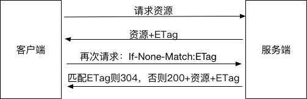

## 一、HTTP 状态码

### 1XX 提示信息，表示目前是协议处理的中间状态，还需要后续的操作

### 2XX 成功

- 200 OK，表示从客户端发来的请求在服务器端被正确处理 ✨
- 201 Created 请求已经被实现，而且有一个新的资源已经依据请求的需要而建立
- 202 Accepted 请求已接受，但是还没执行，不保证完成请求
- 204 No content，表示请求成功，但响应报文不含实体的主体部分
- 206 Partial Content，进行范围请求 ✨

### 3XX 重定向

- 301 moved permanently，永久性重定向，表示资源已被分配了新的 URL
- 302 found，临时性重定向，表示资源临时被分配了新的 URL ✨
- 303 see other，表示资源存在着另一个 URL，应使用 GET 方法丁香获取资源
- 304 not modified，表示服务器允许访问资源，但因发生请求未满足条件的情况
- 307 temporary redirect，临时重定向，和 302 含义相同

### 4XX 客户端错误

- 400 bad request，请求报文存在语法错误 ✨
- 401 unauthorized，表示发送的请求需要有通过 HTTP 认证的认证信息 ✨
- 403 forbidden，表示对请求资源的访问被服务器拒绝 ✨
- 404 not found，表示在服务器上没有找到请求的资源 ✨
- 408 Request timeout, 客户端请求超时
- 409 Confict, 请求的资源可能引起冲突

### 5XX 服务器错误

- 500 internal sever error，表示服务器端在执行请求时发生了错误 ✨
- 501 Not Implemented 请求超出服务器能力范围，例如服务器不支持当前请求所需要的某个功能，或者请求是服务器不支持的某个方法
- 503 service unavailable，表明服务器暂时处于超负载或正在停机维护，无法处理请求
- 505 http version not supported 服务器不支持，或者拒绝支持在请求中使用的 HTTP 版本

## 一、前端缓存

前端缓存可分为两大类：http 缓存和浏览器缓存。

**什么是 HTTP 缓存 ？**

http 缓存指的是: 当客户端向服务器请求资源时，会先抵达浏览器缓存，如果浏览器有“要请求资源”的副本，就可以直接从浏览器缓存中提取而不是从原始服务器中提取这个资源。

常见的 http 缓存只能缓存 get 请求响应的资源，对于其他类型的响应则无能为力，所以后续说的请求缓存都是指 GET 请求。

http 缓存都是从第二次请求开始的。第一次请求资源时，服务器返回资源，并在 respone header 头中回传资源的缓存参数；第二次请求时，浏览器判断这些请求参数，命中强缓存就直接 200，否则就把请求参数加到 request header 头中传给服务器，看是否命中协商缓存，命中则返回 304，否则服务器会返回新的资源。

## 二、常用报文字段

<!-- HTTP 1.1 的标头主要分为四种，通用标头、实体标头、请求标头、响应标头，现在我们来对这几种标头进行介绍 -->

**常用的请求字段 Request Headers**

- Accept：表示客户端期望服务器返回的媒体格式（MIME），比如 text/html、mage/webp、 / 等，通配符*/* 表示任意类型的数据。

- Accept-encoding：向服务器申明客户端（浏览器）接收的编码方法，通常为压缩方法，比如 gzip 等. 这样能够大大减少网络传输的数据量，提高用户显示网页的速度。

- Accept-Language：向服务器申明客户端接收的语言，比如 en-US、zh-CN 等。

- Cache-control：控制浏览器的缓存，比如 private、no-cache 等。

- Connection：连接状态，比如 keep-alive 指的是保持连接状态，close 指关闭连接状态。

- Cookie：告诉服务器关于该用户的信息，存储让服务器辨识用户身份的信息等。

- Content-Type: 说明了实体内对象的媒体类型,表示服务器能够响应的媒体类型

- Host: 请求头指明了服务器的域名（对于虚拟主机来说），以及（可选的）服务器监听的 TCP 端口号。

- Pragma: 是 http 1.1 之前版本的历史遗留字段，仅作为与 http 的向后兼容而定义。

- Refer：是一个链接，告诉服务器该页面是从哪个页面链接进来的。

- User-agent：向服务器发送浏览器的版本、系统、应用程序的信息。

**拓展**

HTTP 压缩，其实就是 HTTP 内容编码的一种,它的过程是这样的:

1. 浏览器发送 Http request 给 Web 服务器, request 中有 Accept-Encoding: gzip, deflate。 (告诉服务器， 浏览器支持 gzip 压缩)

2. Web 服务器接到 request 后， 生成原始的 Response, 其中有原始的 Content-Type 和 Content-Length。

3. Web 服务器通过 Gzip，来对 Response 进行编码， 编码后 header 中有 Content-Type 和 Content-Length(压缩后的大小)， 并且增加了 Content-Encoding:gzip. 然后把 Response 发送给浏览器。

4. 浏览器接到 Response 后，根据 Content-Encoding:gzip 来对 Response 进行解码。 获取到原始 response 后， 然后显示出网页。

**常用的响应字段 Response Headers**

- Accept-Ranges: 当服务器能够处理客户端发送过来的请求时，使用 bytes 来指定;当服务器不能处理客户端发来的请求时，使用 none 来指定

- Connection: HTTP 协议使用 TCP 来管理连接方式，主要有两种连接方式，持久性连接 和 非持久性连接,HTTP 1.1 开始，默认使用持久性连接.也就是和 Keep-Alive 一起使用

- Content-length：是一个数字，表示 http 实体消息（body）的长度。

- Content-Type：表示服务器向客户端发送的头，代表内容的媒体类型和编码格式的统一应答，比如 text/plain; charset=UTF-8。

- Content-Language：该字段是对 Accept-Language 的应答。服务器通过此字段告知客户端返回的 Body 信息的语言是什么。

- Date：如果服务器没有缓存，那么 Date 就是响应的即时生成时间。如果服务器设有缓存，那么 Date 就是响应内容被缓存的时间。

- Etag: 是特定版本的标识，它能够使缓存变得更高效并能够节省带宽.

- Expires：设置响应体的过期时间。如果在过期之前进行访问，就会读取缓存中的版本。

- Last-modified：设置该文件在服务器端中最后被修改的时间。

## 三、http 缓存分类

根据是否需要重新向服务器发起请求来分类，可分为(强缓存，协商缓存); 根据是否可以被单个或者多个用户使用来分类，可分为(私有缓存，共享缓存) ; 强缓存如果生效，不需要再和服务器发生交互，而协商缓存不管是否生效，都需要与服务端发生交互。

### 3.1 强缓存

强制缓存在缓存数据未失效的情况下（即 Cache-Control 的 max-age 没有过期或者 Expires 的缓存时间没有过期），那么就会直接使用浏览器的缓存数据，不会再向服务器发送任何请求。强制缓存生效时，http 状态码为 200。这种方式页面的加载速度是最快的，性能也是很好的，但是在这期间，如果服务器端的资源修改了，页面上是拿不到的，因为它不会再向服务器发请求了。这种情况就是我们在开发种经常遇到的，比如你修改了页面上的某个样式，在页面上刷新了但没有生效，因为走的是强缓存，所以 Ctrl + F5 一顿操作之后就好了。 跟强制缓存相关的 header 头属性有（Pragma/Cache-Control/Expires）

#### 控制强缓存的字段按优先级介绍

1. **Pragma**

   Pragma 是 HTTP/1.1 之前版本遗留的请求通用首部字段，仅作为于 HTTP/1.0 的向后兼容而使用。虽然它是一个通用首部，但是它在响应报文中时的行为没有规范，依赖于浏览器的实现。RFC 中该字段只有 no-cache 一个可选值，会通知浏览器不直接使用缓存，要求向服务器发请求校验新鲜度。因为它优先级最高，当存在时一定不会命中强缓存。

2. **Cache-Control**

   Cache-Control 是一个响应通用首部字段，也是 HTTP/1.1 控制浏览器缓存的主流字段。和浏览器缓存相关的是如下几个响应指令：

- private 表明响应只能被单个用户缓存，不能作为共享缓存（即代理服务器不能缓存它）,不能被 CDN 等缓存。如果要求 HTTP 认证，响应会自动设置为 private。

- public 表明响应可以被任何对象（包括：发送请求的客户端，代理服务器，CDN 等等）缓存

- no-cache 表示请求必须先与服务器确认缓存的有效性，如果有效才能使用缓存（协商缓存），无论是响应报文首部还是请求报文首部出现这个字段均一定不会命中强缓存。Chrome 硬性重新加载（Command+shift+R）会在请求的首部加上 Pragma：no-cache 和 Cache-Control：no-cache。

- no-store 不缓存请求或响应的任何内容,表示禁止浏览器以及所有中间缓存存储任何版本的返回响应，一定不会出现强缓存和协商缓存，适合个人隐私数据或者经济类数据。

- max-age=[s] 响应的最大值. max-age（单位为 s）设置缓存的存在时间，相对于发送请求的时间。只有响应报文首部设置 Cache-Control 为非 0 的 max-age 或者设置了大于请求日期的 Expires（下文会讲）才有可能命中强缓存。当满足这个条件，同时响应报文首部中 Cache-Control 不存在 no-cache、no-store 且请求报文首部不存在 Pragma 字段，才会真正命中强缓存。以下所有图片均为刷新（command+R）的截图。

3. **Expires**  
   Expires 是一个响应首部字段，它指定了一个日期/时间，在这个时间/日期之前，HTTP 缓存被认为是有效的。无效的日期比如 0，表示这个资源已经过期了。如果同时设置了 Cache-Control 响应首部字段的 max-age，则 Expires 会被忽略。它也是 HTTP/1.1 之前版本遗留的通用首部字段，仅作为于 HTTP/1.0 的向后兼容而使用。

- **注意:**  
  在 chrome 浏览器中返回的 200 状态会有两种情况：

1、from memory cache
(从内存中获取/一般缓存更新频率较高的 js、图片、字体等资源)

2、from disk cache
(从磁盘中获取/一般缓存更新频率较低的 js、css 等资源)

这两种情况是 chrome 自身的一种缓存策略，这也是为什么 chrome 浏览器响应的快的原因。其他浏览返回的是已缓存状态，没有标识是从哪获取的缓存。

### 3.2 协商缓存

当第一次请求时服务器返回的响应头中没有 Cache-Control 和 Expires 或者 Cache-Control 和 Expires 过期还或者它的属性设置为 no-cache 时(即不走强缓存)，那么浏览器第二次请求时就会与服务器进行协商，与服务器端对比判断资源是否进行了修改更新。如果服务器端的资源没有修改，那么就会返回 304 状态码，告诉浏览器可以使用缓存中的数据，这样就减少了服务器的数据传输压力。如果数据有更新就会返回 200 状态码，服务器就会返回更新后的资源并且将缓存信息一起返回。跟协商缓存相关的 header 头属性有（ETag/If-Not-Match 、Last-Modified/If-Modified-Since）请求头和响应头需要成对出现

当浏览器第一次向服务器发送请求时，会在响应头中返回协商缓存的头属性：ETag 和 Last-Modified,其中 ETag 返回的是一个 hash 值，Last-Modified 返回的是 GMT 格式的最后修改时间。然后浏览器在第二次发送请求的时候，会在请求头中带上与 ETag 对应的 If-Not-Match，其值就是响应头中返回的 ETag 的值，Last-Modified 对应的 If-Modified-Since。服务器在接收到这两个参数后会做比较，如果返回的是 304 状态码，则说明请求的资源没有修改，浏览器可以直接在缓存中取数据，否则，服务器会直接返回数据。

#### 控制协商缓存的字段

1. **Last-Modified/If-Modified-Since**

   If-Modified-Since 是一个请求首部字段，并且只能用在 GET 或者 HEAD 请求中。Last-Modified 是一个响应首部字段，包含服务器认定的资源作出修改的日期及时间。当带着 If-Modified-Since 头访问服务器请求资源时，服务器会检查 Last-Modified，如果 Last-Modified 的时间早于或等于 If-Modified-Since 则会返回一个不带主体的 304 响应，否则将重新返回资源。

2. **ETag/If-None-Match**

   ETag 是一个响应首部字段，是在 HTTP/1.1 出现的。它是根据实体内容生成的一段 hash 字符串，标识资源 的状态，由服务端产生。If-None-Match 是一个条件式的请求首部。如果请求资源时在请求首部加上这个字段，值为之前服务器端返回的资源上的 ETag，则当且仅当服务器上没有任何资源的 ETag 属性值与这个首部中列出的时候，服务器才会返回带有所请求资源实体的 200 响应，否则服务器会返回不带实体的 304 响应。 ETag 优先级比 Last-Modified 高，同时存在时会以 ETag 为准。

因为 ETag 的特性，所以相较于 Last-Modified 有一些优势：

    1.  某些情况下服务器无法获取资源的最后修改时间
    2.  资源的最后修改时间变了但是内容没变，使用ETag可以正确缓存
    3.  如果资源修改非常频繁，在秒以下的时间进行修改，Last-Modified只能精确到秒

所以根据上面的特点，浏览器缓存有下面的优点：

1. 减少冗余的数据传输,重复利用资源减少网络带宽消耗

2. 减少服务器负担,降低请求次数或者减少传输内容从而减轻服务器压力

3. 加快客户端加载网页的速度,减少网页打开时间

## 四、如何使用浏览器缓存

一般需要缓存的资源有 html 页面和其他静态资源：
1、html 页面缓存的设置主要是在<head>标签中嵌入<meta>标签，这种方式只对页面有效，对页面上的资源无效
1.1、html 页面禁用缓存的设置如下：

<meta http-equiv="pragma" content="no-cache">
// 仅有IE浏览器才识别的标签，不一定会在请求字段加上Pragma，但的确会让当前页面每次都发新请求
<meta http-equiv="cache-control" content="no-cache">
// 其他主流浏览器识别的标签
<meta http-equiv="expires" content="0">
// 仅有IE浏览器才识别的标签，该方式仅仅作为知会IE缓存时间的标记，你并不能在请求或响应报文中找到Expires字段

1.2、html 设置缓存如下：

<meta http-equiv="Cache-Control" content="max-age=7200" />
// 其他主流浏览器识别的标签
<meta http-equiv="Expires" content="Mon, 20 Aug 2018 23:00:00 GMT" />
// 仅有IE浏览器才识别的标签

2、静态资源的缓存一般是在 web 服务器上

3、不想使用缓存的几种方式：
3.1、Ctrl + F5 强制刷新，都会直接向服务器提取数据。
3.2、按 F5 刷新或浏览器的刷新按钮，默认加上 Cache-Control：max-age=0，即会走协商缓存。
3.2、在 IE 浏览器下不想使用缓存的做法：打开 IE，点击工具栏上的工具->Internet 选项->常规->浏览历史记录 设置. 选择“从不”，然后保存。最后点击“删除”把 Internet 临时文件都删掉 （IE 缓存的文件就是 Internet 临时文件）。
3.3、还有就是上面 1、2 中禁用缓存的做法
3.4、对于其他浏览器也都有清除缓存的办法

五、HTTP 缓存的几个注意点
1、强缓存情况下，只要缓存还没过期，就会直接从缓存中取数据，就算服务器端有数据变化，也不会从服务器端获取了，这样就无法获取到修改后的数据。决解的办法有：在修改后的资源加上随机数,确保不会从缓存中取。

例如：
http://www.kimshare.club/kim/common.css?v=22324432
http://www.kimshare.club/kim/common.2312331.css

2、尽量减少 304 的请求，因为我们知道，协商缓存每次都会与后台服务器进行交互，所以性能上不是很好。从性能上来看尽量多使用强缓存。

3、在 Firefox 浏览器下，使用 Cache-Control: no-cache 是不生效的，其识别的是 no-store。这样能达到其他浏览器使用 Cache-Control: no-cache 的效果。所以为了兼容 Firefox 浏览器，经常会写成 Cache-Control: no-cache，no-store。

4、与缓存相关的几个 header 属性有：Vary、Date/Age。
Vary：
vary 本身是“变化”的意思，而在 http 报文中更趋于是“vary from”（与。。。不同）的含义，它表示服务端会以什么基准字段来区分、筛选缓存版本。
在服务端有着这么一个地址，如果是 IE 用户则返回针对 IE 开发的内容，否则返回另一个主流浏览器版本的内容。
格式：Vary: User-Agent
知会代理服务器需要以 User-Agent 这个请求首部字段来区别缓存版本，防止传递给客户端的缓存不正确。

Date/Age：
响应报文中的 Date 和 Age 字段：区分其收到的资源是否命中了代理服务器的缓存。
Date 理所当然是原服务器发送该资源响应报文的时间（GMT 格式），如果你发现 Date 的时间与“当前时间”差别较大，或者连续 F5 刷新发现 Date 的值都没变化，则说明你当前请求是命中了代理服务器的缓存。
Age 也是响应报文中的首部字段，它表示该文件在代理服务器中存在的时间（秒），如文件被修改或替换，Age 会重新由 0 开始累计。

总结:
1、对于强制缓存，服务器通知浏览器一个缓存时间，在缓存时间内，下次请求，直接用缓存，不在时间内，执行协商缓存策略。
2、对于协商缓存，将缓存信息中的 Etag 和 Last-Modified 通过请求发送给服务器，由服务器校验，返回 304 状态码时，浏览器直接使用缓存。

浏览器首次和再次发送 http 请求的执行流程图如下：

**浏览器第一次发起请求**

**在浏览器再次发起请求时**

在浏览器第一次发起请求时,本地无缓存，向 web 服务器发送请求，服务器端响应请求，浏览器端缓存。过程如下：

在第一次请求时，服务器会将页面最后修改时间通过 Last-Modified 标识由服务器发送给客户端，客户端记录修改时间；服务器还会生成一个 Etag，并发送给客户端。

**在浏览器再次发起请求时**

- 浏览器请求某一资源时，会先获取该资源缓存的 header 信息，然后根据 header 中的 Cache-Control 和 Expires 来判断是否过期。若没过期则直接从缓存中获取资源信息，包括缓存的 header 的信息，所以此次请求不会与服务器进行通信。这里判断是否过期，则是强缓存相关。后面会讲 Cache-Control 和 Expires 相关。

- 如果显示已过期，浏览器会向服务器端发送请求，这个请求会携带第一次请求返回的有关缓存的 header 字段信息，比如客户端会通过 If-None-Match 头将先前服务器端发送过来的 Etag 发送给服务器，服务会对比这个客户端发过来的 Etag 是否与服务器的相同，若相同，就将 If-None-Match 的值设为 false，返回状态 304，客户端继续使用本地缓存，不解析服务器端发回来的数据，若不相同就将 If-None-Match 的值设为 true，返回状态为 200，客户端重新机械服务器端返回的数据；客户端还会通过 If-Modified-Since 头将先前服务器端发过来的最后修改时间戳发送给服务器，服务器端通过这个时间戳判断客户端的页面是否是最新的，如果不是最新的，则返回最新的内容，如果是最新的，则返回 304，客户端继续使用本地缓存。

<!-- 
简略流程图如下：
 -->

<!-- ### 浏览器 HTTP 缓存由 HTTP 报文的首部字段决定

 -->

https://juejin.im/post/5a673af06fb9a01c927ed880

   <!-- 普通刷新会启用弱缓存，忽略强缓存。只有在地址栏或收藏夹输入网址、通过链接引用资源等情况下，浏览器才会启用强缓存，这也是为什么有时候我们更新一张图片、一个 js 文件，页面内容依然是旧的，但是直接浏览器访问那个图片或文件，看到的内容却是新的。 -->

强缓存:

Expires(HTTP1.0)：Exprires 的值为服务端返回的数据到期时间。当再次请求时的请求时间小于返回的此时间，则直接使用缓存数据。但由于服务端时间和客户端时间可能有误差，这也将导致缓存命中的误差。另一方面，Expires 是 HTTP1.0 的产物，故现在大多数使用 Cache-Control 替代。

缺点：使用的是绝对时间，如果服务端和客户端的时间产生偏差，那么会导致命中缓存产生偏差。

Pragma(HTTP1.0)：HTTP1.0 时的遗留字段，当值为"no-cache"时强制验证缓存，Pragma 禁用缓存，如果又给 Expires 定义一个还未到期的时间，那么 Pragma 字段的优先级会更高。服务端响应添加'Pragma': 'no-cache'，浏览器表现行为和刷新(F5)类似。

Cache-Control(HTTP1.1)：有很多属性，不同的属性代表的意义也不同：
private：客户端可以缓存
public：客户端和代理服务器都可以缓存
max-age=t：缓存内容将在 t 秒后失效
no-cache：需要使用协商缓存来验证缓存数据
no-store：所有内容都不会缓存

请注意 no-cache 指令很多人误以为是不缓存，这是不准确的，no-cache 的意思是可以缓存，但每次用应该去想服务器验证缓存是否可用。no-store 才是不缓存内容。当在首部字段 Cache-Control 有指定 max-age 指令时，比起首部字段 Expires，会优先处理 max-age 指令。命中强缓存的表现形式：Firefox 浏览器表现为一个灰色的 200 状态码。Chrome 浏览器状态码表现为 200 (from disk cache)或是 200 OK (from memory cache)。

协商缓存

协商缓存需要进行对比判断是否可以使用缓存。浏览器第一次请求数据时，服务器会将缓存标识与数据一起响应给客户端，客户端将它们备份至缓存中。再次请求时，客户端会将缓存中的标识发送给服务器，服务器根据此标识判断。若未失效，返回 304 状态码，浏览器拿到此状态码就可以直接使用缓存数据了。

Last-Modified：服务器在响应请求时，会告诉浏览器资源的最后修改时间。

if-Modified-Since：浏览器再次请求服务器的时候，请求头会包含此字段，后面跟着在缓存中获得的最后修改时间。服务端收到此请求头发现有 if-Modified-Since，则与被请求资源的最后修改时间进行对比，如果一致则返回 304 和响应报文头，浏览器只需要从缓存中获取信息即可。
如果真的被修改：那么开始传输响应一个整体，服务器返回：200 OK
如果没有被修改：那么只需传输响应 header，服务器返回：304 Not Modified

if-Unmodified-Since: 从某个时间点算起, 是否文件没有被修改，使用的是相对时间，不需要关心客户端和服务端的时间偏差。
如果没有被修改：则开始`继续'传送文件，服务器返回: 200 OK
如果文件被修改：则不传输，服务器返回: 412 Precondition failed (预处理错误)
这两个的区别是一个是修改了才下载一个是没修改才下载。如果在服务器上，一个资源被修改了，但其实际内容根本没发生改变，会因为 Last-Modified 时间匹配不上而返回了整个实体给客户端（即使客户端缓存里有个一模一样的资源）。为了解决这个问题，HTTP1.1 推出了 Etag。

Etag：服务器响应请求时，通过此字段告诉浏览器当前资源在服务器生成的唯一标识（生成规则由服务器决定）

If-Match：条件请求，携带上一次请求中资源的 ETag，服务器根据这个字段判断文件是否有新的修改

If-None-Match：再次请求服务器时，浏览器的请求报文头部会包含此字段，后面的值为在缓存中获取的标识。服务器接收到次报文后发现 If-None-Match 则与被请求资源的唯一标识进行对比。
不同，说明资源被改动过，则响应整个资源内容，返回状态码 200。
相同，说明资源无心修改，则响应 header，浏览器直接从缓存中获取数据信息。返回状态码 304.

但是实际应用中由于 Etag 的计算是使用算法来得出的，而算法会占用服务端计算的资源，所有服务端的资源都是宝贵的，所以就很少使用 Etag 了。

浏览器地址栏中写入 URL，回车浏览器发现缓存中有这个文件了，不用继续请求了，直接去缓存拿（最快）
F5 就是告诉浏览器，别偷懒，好歹去服务器看看这个文件是否有过期了。于是浏览器就胆胆襟襟的发送一个请求带上 If-Modify-since
Ctrl+F5 告诉浏览器，你先把你缓存中的这个文件给我删了，然后再去服务器请求个完整的资源文件下来。于是客户端就完成了强行更新的操作

缓存场景

对于大部分的场景都可以使用强缓存配合协商缓存解决，但是在一些特殊的地方可能需要选择特殊的缓存策略

- 对于某些不需要缓存的资源，可以使用 Cache-control: no-store ，表示该资源不需要缓存
- 对于频繁变动的资源，可以使用 Cache-Control: no-cache 并配合 ETag 使用，表示该资源已被缓存，但是每次都会发送请求询问资源是否更新
- 对于代码文件来说，通常使用 Cache-Control: max-age=31536000 并配合策略缓存使用，然后对文件进行指纹处理，一旦文件名变动就会立刻下载新的文件
